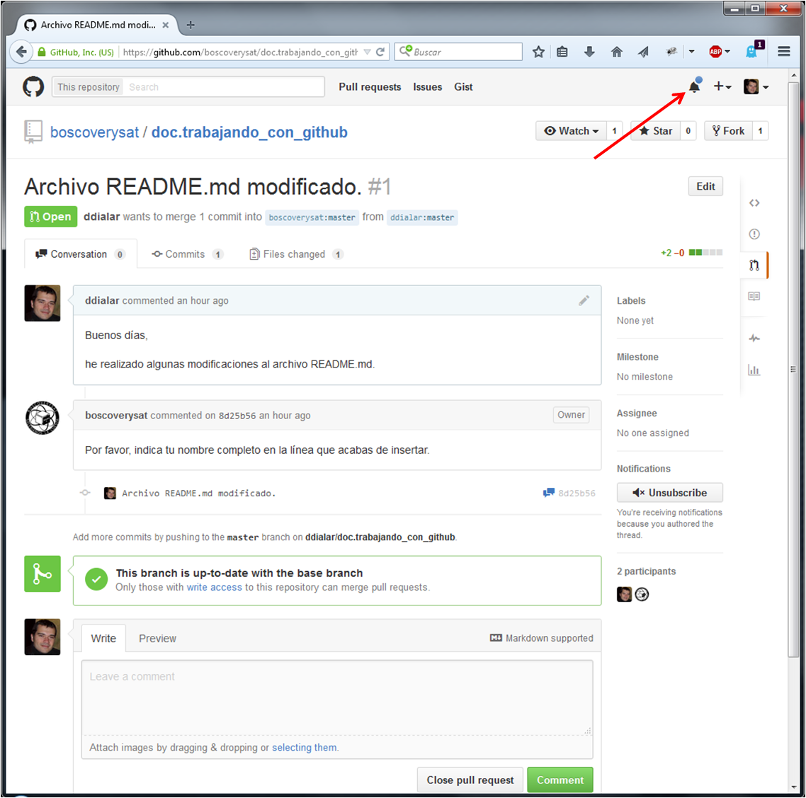

# Uso de colaborativo de GitHub

## Resumen

El presente documento recoge las operaciones necesarias para el uso colaborativo de repositorios en la plataforma **[GitHub](http://github.com)**.

## Autoría y Licencia

- Autor: **Dailos Rafael Díaz Lara** ( ddialar@gmail.com )
- Fecha: **06/09/2015**
- Versión: **1.0.0**
- Licencia: [](http://creativecommons.org/licenses/by-nc-sa/4.0/)

## Requisitos previos

- Disponer de una cuenta operativa en la plataforma **[GitHub](http://github.com)**.
- Tener instalado el programa **[Git](https://git-scm.com/)**, en una versión 1.9.0 o superior, en el equipo informático en el que se esté trabajando.
- Disponer de conexión a internet.

## Procedimiento

### Introducción.

Cuando deseamos trabajar con un repositorio compartido, que por lo general ha sido creado por una tercera persona, lo que debemos hacer es copiar dicho repositorio a nuestra cuenta de GitHub. A esta operación se la denomina **fork** y su función es la de crear una copia íntegra del repositorio sobre el que deseamos trabajar, tal y como se encuentra en el momento de hacer la copia, y la coloca en nuestra cuenta.

Ahora que ya disponemos del repositorio en nuestra cuenta, ya podemos trabajar con su contenido pero no podemos hacerlo directamente en la web. Por esta razón, deberemos hacer una segunda copia del repositorio que se encuentra en nuestra cuenta y colocarla en nuestro equipo local. A esta operación se la denomina **clonación**.

Después de que hayamos realizado las correspondiente modificaciones de manera local, deberemos actualizar el contenido del repositorio que está alojado en nuestra cuenta de GitHub. Para ello, subiremos los cambios realizados mediante una operación **push**.

Finalmente, si deseamos transferir nuestras modificaciones al repositorio original que copiamos inicialmente la información, deberemos solicitar a los administradores de dicho repositorio, que acepten nuestros cambios. Esto se hace mediante una operación **pull request**.

### Paso 1. Creando el fork del repositorio.

Lo primero que debemos hacer es localizar el repositorio con el que deseamos trabajar.


Una vez autenticados a nuestra cuenta de GitHub, navegaremos hasta el perfil público donde se encuentra el repositorio que deseamos utilizar.


Después de haber localizado la cuenta, buscaremos el repositorio y enraremos en él.

Acto seguido, haremos clic izquierdo sobre el botón que dice **fork**.


Esto iniciará el proceso de copia del repositorio a nuestra cuenta. Esta operación tardará más o menos dependiendo del volumen de información que contenga el repositorio con el que vamos a trabajar.


Cuando el proceso de copia haya finalizado, nos encontraremos de nuevo en nuestro perfil de GitHub y comprobaremos que ya disponemos de una copia del repositorio.


Además de esto, si accedermos a la página pública de nuestro perfil del GitHub, podremos ver que ya se muestra el repositorio que acabamos de copiar.


ahora ha llegado el momento de descargar el repositorio a nuestro sistema local.

### Paso 2. Clonar el repositorio en nuesto equipo.

Para descargar una copia del repositorio en nuestro sistema local, deberemos abrir una consola de comandos (si están en MS Windows) o una terminal de comandos (si estás en GNU/Linux o Mac OS), en el directorio del sistema donde queramos guardar el contenido del repositorio.

Una vez arrancado el terminal, procederemos a ejecutar el siguiente comando:

```sh
$ git clone https://github.com/<user_name>/<repository_name>.git
```
Un ejemplo de este procedimiento se muestra en la siguiente figura:


Después de que haya finalizado la descarga del repositorio, tendremos una copia del mismo en nuestro equipo. Además de esto, como hemos utilizado la opción **clone** de Git en lugar de realizar una descarga en bruto del mismo, este repositorio está vinculado con el que se encuentra en nuestra cuenta de GitHub, cosa que no sucede cuando hacer las descargas sin más.

Ahora que tenemos acceso al contenido del repositorio, podemos modificar sus archivos. Es este caso, vamos a añadir una nueva línea de texto al archivo README.md, tal y como se muestra en la siguiente imagen.


Cuando hayamos acabado de trabajar con los archivos, deberemos actualizar el repositorio local que se encuentra en nuestro equipo. Para ello, deberemos ejecutar los siguientes comandos, a través de la terminal de comandos:

```sh
$ git add --all # Este comando preparará los archios modificados para ser actualizados.
$ git commit -m "<Comentario reativo a los cambios realizados>" # Este comando actualizará en el repositorio local, los cambios realizados.
```


Ahora toca actualizar los cambios en el repositorio de nuestra cuenta de GitHub.

### Paso 3. Actualizando el repositorio en GitHub.

Para actualizar el repositorio de GitHub con el contenido de nuestro repositorio local, deberemos emplear la siguiente instrucción en la terminal de comandos:

```sh
$ git push -u origin master
```

Este comando hará que Git se conecte con nuestra cuenta de GitHub y por lo tanto, se nos solicitará que nos autentiquemos para poder realizar la operación.


Una vez finalizado el proceso de subida del repositorio, podremos actualizar nuestro perfil y comprobaremos que nuestros cambios están correctamente almacenados en GitHub.

Después de esto, debemos solicitar al propietario del repositorio original, que acepte las modificaciones que hemos realizado y las incluya en el mismo.

### Paso 4. Generando un Pull Request.

Para poder crear un Pull Request del repositorio, deberemos acceder a nuestra cuenta de GitHub y localizar el repositorio en cuestión.

Cuando hayamos hecho esto, deberemos hacer clic izquierdo sobre el botón que se muestra en la siguiente imagen:


Ahora accederemos a la siguiente figura donde se recoge un resumen de las modificaciones que hemos llevado a cabo, así como el botón titulado **Create pull request**, sobre el cual, deberemos hacer clic izquierdo.


Cada Pull Request que generemos, debe tener un título que describa el objetivo del mismo, así como un breve comentario donde se indique qué se ha hecho en el repositorio.

Una vez hecho esto, creamos la petición haciendo clic en el botón titulado **Create pull request**.


Ya hemos creado nuestro pull request y ahora quedamos a la espera de que los responsables del repositorio original comprueben nuestra petición.


### Paso 5. El dueño del repositorio nos solicita que hagamos cambios.

Después de que el propietario del repositorio original haya revisado nuestra solicitud para que incorpore nuestros cambios a su código, éste puede decidir que antes debemos hacer ciertas modificaciones.

Para ello, nos enviará un mensaje que aparecerá reflejado en el área de notificaciones de nuestro perfil de GitHub.



Al hacer clic izquierdo sobre el símbolo del área de notificaciones, accederemos a la sección donde están todos los mensajes que hemos recibido.


Accederemos al contenido del nuevo mensaje haciendo clic izquierdo sobre el mismo.

Aquí podremos ver el contenido de la modificación que hemos realizado así como el mensaje que nos ha enviado el propietario del repositorio.


Ahora que ya sabemos qué modificaciones nos están solicitando, procedemos a realizarlas en nuestro repositorio local, el que se encuentra en nuestro equipo.


Después de haber realizado las modificaciones pertinentes, debemos volver a actualizar nuestro repositorio local así como el repositorio en nuestra cuenta de GitHub, de la misma manera que lo hicimos la primera vez.


Una vez finalizada la subida del código, verificamos que ésta se ha realizado correctamente.


Finalmente, para indicarle el propietario del repositorio que ya hemos realizado las modificaciones solicitadas, deberemos dejar un nuevo comentario en el pull request.


Una vez enviado el mensaje, éste aparecerá en el histórico de la conversación que estamos manteniendo con el propietario del repositorio y a él, le llegará la correspondiente notificación.


Ahora sólo queda esperar que los nuevos cambios sean aceptados o que nos soliciten alguna modificación adicional.

### Paso 6. El dueño del repositorio acepta nuestras aportaciones.

Cuando los cambios que hemos propuesto son aceptados e incluidos en el código del repositorio original, su propietario nos enviará un mensaje que podremos ver a través del área de notificaciones de nuestro perfil.


Al acceder al contenido del mensaje que nos han enviado desde el equipo que administra el repositorio sobre el que hemos estado trabajando, podemos ver que el estado de nuestro pull request es **Merged**, lo que significa que nuestro código forma parte del repositorio original.


## Conclusiones finales

Este es el procedimiento básico para solicitar que nuestras modificaciones a un código ya existente se tengan en cuenta.
